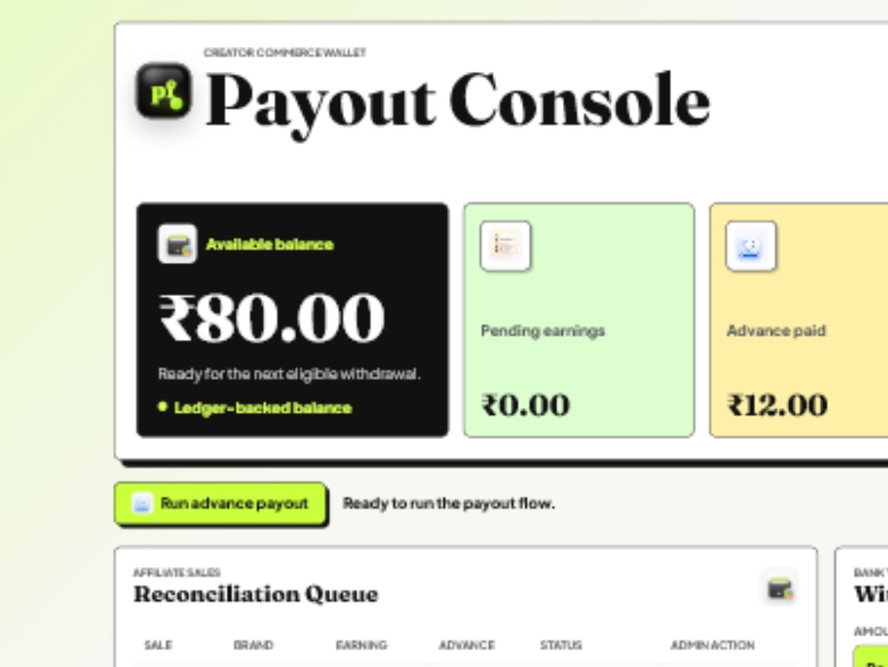
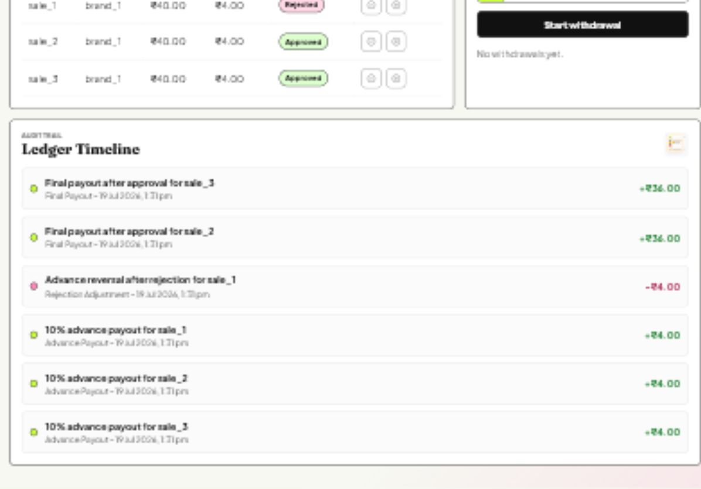

# Postfaym Payout Assignment

A JavaScript implementation of a creator payout management system for affiliate sales. The project includes a Node.js API, a React dashboard, service-level tests, SQL schema, and design documentation.

The main design choice is a ledger-based payout model. Instead of mutating one balance field after every event, every financial movement is recorded as a ledger entry. This keeps advance payouts, final payouts, rejection adjustments, withdrawal debits, and failed payout credits auditable.

## Quick Start

```bash
npm install
npm run dev
```

The API runs on `http://localhost:4000` and the dashboard runs on `http://127.0.0.1:5173`.

Useful commands:

```bash
npm test
npm run demo
npm run build
npm run api
npm run dev:web
```

## What Is Included

| Expected deliverable | Where it is covered |
| --- | --- |
| Low-Level Design (LLD) | `docs/lld.md` |
| Database schema with relationships | `backend/src/db/schema.sql`, `docs/schema.md` |
| Class design or equivalent design | Service modules in `backend/src/services`, explained in `docs/lld.md` |
| APIs/endpoints | `backend/src/app.js`, `docs/api.md` |
| Edge cases and failure scenarios | Tests in `backend/src/tests/payout.test.js`, notes in `docs/lld.md` |
| Working implementation in JavaScript | Node.js backend and React frontend |
| Design decisions and trade-offs | `docs/lld.md` and this README |

## Screenshots




## Product Flow

The seeded demo starts with three pending sales of Rs 40 each for `john_doe`.

1. Run advance payout.
2. Each pending sale receives a 10% advance, so Rs 12 is advanced in total.
3. Reconcile one sale as rejected and two sales as approved.
4. Final settlement becomes `-4 + 36 + 36 = Rs 68`.

You can verify this directly:

```bash
npm run demo
```

Expected output:

```text
Assignment scenario
Advance payout: Rs 12.00
Final settlement after reconciliation: Rs 68.00
Ledger balance including prior advance: Rs 80.00
```

The ledger balance includes the earlier Rs 12 advance plus the Rs 68 final settlement.

## API Summary

```text
GET    /api/health
GET    /api/users
GET    /api/brands
GET    /api/sales
POST   /api/sales
POST   /api/payouts/advance/run
POST   /api/sales/:saleId/reconcile
GET    /api/users/:userId/balance
GET    /api/users/:userId/ledger
GET    /api/withdrawals?userId=:userId
POST   /api/withdrawals
PATCH  /api/withdrawals/:withdrawalId/status
POST   /api/demo/reset
```

## Frontend

The dashboard is built as a creator earnings console. It includes:

- wallet overview
- pending, approved, rejected, and advance metrics
- advance payout runner
- reconciliation queue
- withdrawal panel
- failed payout recovery controls
- ledger timeline

The UI is intentionally closer to a creator-commerce product than a plain admin CRUD screen.

## Design Decisions

- Ledger entries are the source of truth for balances.
- Sale rows keep `advancePaidAt` and `advancePaidCents` to prevent duplicate advance payouts.
- Reconciliation only works from `pending` to `approved` or `rejected`.
- Rejected sales create a debit entry for the advance amount already paid.
- Withdrawals debit the ledger when initiated.
- Failed, cancelled, or rejected withdrawals credit the amount back once.
- Active or successful withdrawals enforce the 24 hour withdrawal rule.
- Recoverable failed withdrawals do not keep the cooldown locked, so the user can retry.

## Trade-Offs

This project uses an in-memory repository so the assignment is easy to run locally without native database setup. The SQL schema is included and mirrors the same entities and relationships. In production, the store would be replaced with PostgreSQL or MySQL transactions around the same service boundaries.

The design favors auditability and idempotency over the simplest possible implementation. That adds a little structure, but it makes payout behavior easier to test, debug, and explain.