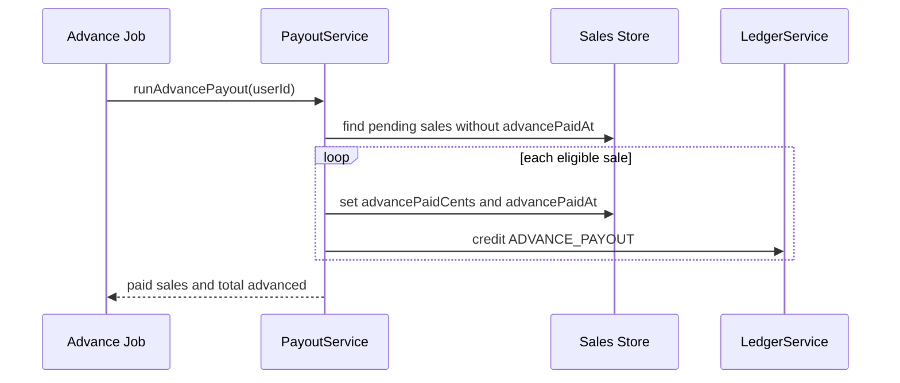
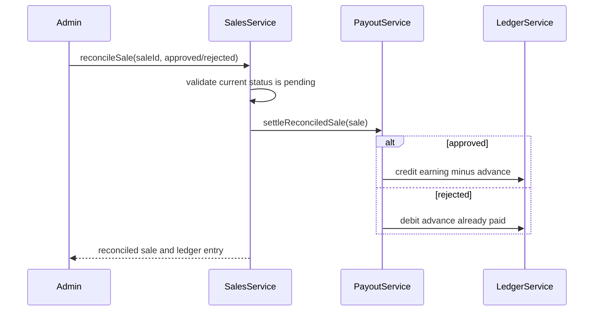
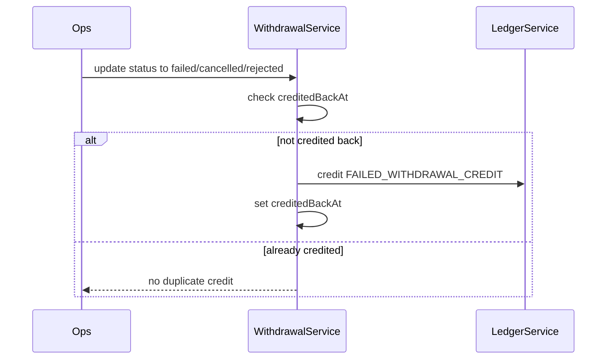

# Low-Level Design

## Problem

The system manages payouts for affiliate sales. Sales start as `pending`. A pending sale can receive a 10% advance payout. Later, an admin reconciles the sale as `approved` or `rejected`. Final payouts must account for any advance already transferred.

The system also supports user withdrawals, a 24 hour withdrawal restriction, and recovery when a withdrawal fails, is cancelled, or is rejected.

## Main Entities

### User

Represents a creator or affiliate user.

Fields:

- `id`
- `name`
- `handle`
- `createdAt`

### Brand

Represents a merchant or campaign brand.

Fields:

- `id`
- `name`

### Sale

Represents a commission earning event.

Fields:

- `id`
- `userId`
- `brandId`
- `status`: `pending`, `approved`, `rejected`
- `earningCents`
- `advancePaidCents`
- `advancePaidAt`
- `reconciledAt`
- `createdAt`

### LedgerEntry

Represents one money movement.

Types:

- `ADVANCE_PAYOUT`
- `FINAL_PAYOUT`
- `REJECTION_ADJUSTMENT`
- `WITHDRAWAL_DEBIT`
- `FAILED_WITHDRAWAL_CREDIT`

Fields:

- `id`
- `userId`
- `saleId`
- `withdrawalId`
- `type`
- `direction`: `credit` or `debit`
- `amountCents`
- `description`
- `metadata`
- `createdAt`

### Withdrawal

Represents a payout transfer request.

Statuses:

- `initiated`
- `processing`
- `success`
- `failed`
- `cancelled`
- `rejected`

Fields:

- `id`
- `userId`
- `amountCents`
- `status`
- `creditedBackAt`
- `createdAt`
- `updatedAt`

## Service Design

### SalesService

Responsibilities:

- list sales
- create sales
- reconcile pending sales
- block invalid status transitions

### PayoutService

Responsibilities:

- run advance payout job
- calculate 10% advance
- settle approved and rejected sales
- prevent duplicate advance payouts

### LedgerService

Responsibilities:

- create credit and debit ledger entries
- list a user's audit trail
- compute available balance from ledger entries

### WithdrawalService

Responsibilities:

- create withdrawals
- enforce the 24 hour withdrawal rule
- update withdrawal status
- credit back failed, cancelled, or rejected withdrawals exactly once

### BalanceService

Responsibilities:

- prepare wallet summary
- calculate pending, approved, rejected, credit, debit, and advance totals

## Workflow Diagrams

### Advance Payout

### Reconciliation

### Failed Withdrawal Recovery

## Edge Cases

- Running the advance payout job multiple times should not duplicate credits.
- A sale that has already been approved or rejected cannot be reconciled again.
- A rejected sale with advance paid creates a debit adjustment.
- A rejected sale without advance paid does not create a payout entry.
- Withdrawal amount must be positive.
- Withdrawal amount cannot exceed available balance.
- A user cannot make another active withdrawal within 24 hours.
- Failed, cancelled, or rejected withdrawals are credited back once.
- Retrying recovery on the same failed withdrawal does not double-credit the user.
- Unknown users, brands, sales, and withdrawals return errors.

## Design Trade-Offs

### Ledger instead of direct balance updates

The ledger makes every payout movement traceable. A direct `balance` column would be simpler, but it would make reconciliation bugs harder to audit.

### In-memory store for the assignment

The implementation uses a repository-style in-memory store for fast local setup. The SQL schema is included separately and follows the same model. In a production system, each service method that changes money would run inside a database transaction.

### Advance payout idempotency

The sale stores `advancePaidAt`, and the payout job also keeps an idempotency record for the job input. That protects against both per-sale duplication and repeated job execution.

### Withdrawal cooldown and failed transfers

Only active or successful withdrawals count toward the 24 hour restriction. Once a withdrawal fails, is cancelled, or is rejected, the amount is credited back and the user can retry.