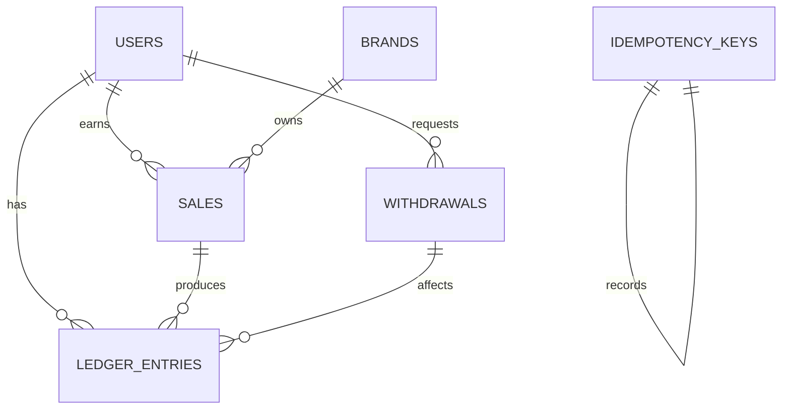

# Database Schema

The SQL schema lives in `backend/src/db/schema.sql`.

## Relationships

## Tables

### users

Stores creator accounts.

Primary key: `id`

### brands

Stores supported affiliate brands.

Primary key: `id`

### sales

Stores affiliate sale events.

Important columns:

- `status`
- `earning_cents`
- `advance_paid_cents`
- `advance_paid_at`
- `reconciled_at`

The `advance_paid_at` field is the direct guard against duplicate advance payout for a sale.

### ledger_entries

Stores all financial movements.

Credits increase balance. Debits reduce balance.

Important types:

- `ADVANCE_PAYOUT`
- `FINAL_PAYOUT`
- `REJECTION_ADJUSTMENT`
- `WITHDRAWAL_DEBIT`
- `FAILED_WITHDRAWAL_CREDIT`

### withdrawals

Stores transfer attempts and recovery state.

`credited_back_at` prevents duplicate failed-payout recovery.

### idempotency_keys

Stores job/request fingerprints so repeated operations can return the previous result.

## Indexes

- `idx_sales_user_status` helps find pending sales for a user.
- `idx_sales_brand` helps filter sales by brand.
- `idx_ledger_user_created` helps load wallet timelines.
- `idx_ledger_sale` helps audit sale-level payout history.
- `idx_ledger_withdrawal` helps audit withdrawal recovery.
- `idx_withdrawals_user_created` helps enforce withdrawal cooldowns.